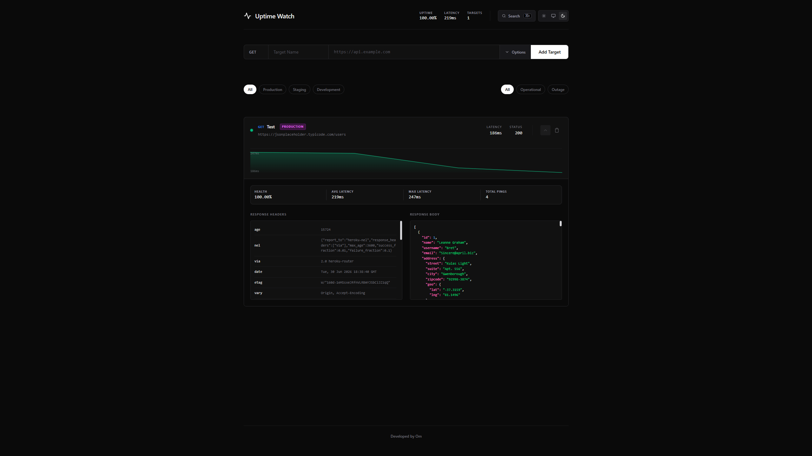
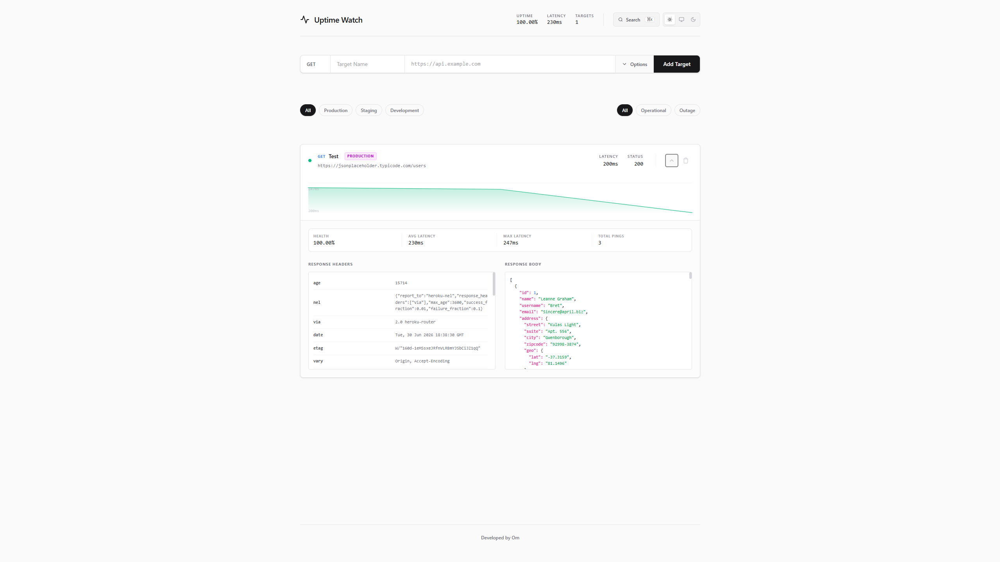

# Uptime Watch

A robust, real-time API monitoring service and dashboard. This monorepo contains both the Ruby on Rails backend API and the React/Vite frontend dashboard for tracking endpoint health, uptime, and latency via asynchronous background workers.

<p align="center">
  
  &nbsp;
  
</p>

---

## Tech Stack

### Backend (`/monitor_api`)
- **Framework:** Ruby on Rails (API Mode)
- **Database:** PostgreSQL
- **Background Jobs:** Solid Queue
- **Concurrency:** Concurrent HTTP requests via background workers

### Frontend (`/monitor_web`)
- **Framework:** React + TypeScript
- **Build Tool:** Vite
- **Styling:** Tailwind CSS

---

## Features

- **Real-time Monitoring:** Tracks HTTP status codes and response latency (in milliseconds).
- **Asynchronous Pings:** Background jobs automatically ping registered endpoints at configurable intervals.
- **Interactive Dashboard:** Sleek, dark-mode optimized React frontend with sparkline charts, environment filtering, and a `⌘K` command palette.
- **Custom Headers:** Supports custom JSON headers for pinging authenticated or protected routes.
- **Environment Tagging:** Organizes endpoints by environment (Production, Staging, Development).

---

## Getting Started

### Prerequisites
- Ruby 3.x+
- Node.js (v16+) and npm
- PostgreSQL

### 1. Backend Setup (`monitor_api`)
Navigate to the backend directory, install dependencies, and setup the database.
```bash
cd monitor_api
bundle install
rails db:setup
rails db:migrate
```
Start the Rails server (and ensure Solid Queue background workers are running):
```bash
rails server
```

### 2. Frontend Setup (`monitor_web`)
In a new terminal window, navigate to the frontend directory and install dependencies.
```bash
cd monitor_web
npm install
```
Start the Vite development server:
```bash
npm run dev
```
The application will be available at `http://localhost:5173`.

---

## Environment Variables

### Backend (`monitor_api`)
To run the backend securely, configure these variables (or use a `.env` file):
- `DATABASE_URL` (PostgreSQL connection string)
- `RAILS_MASTER_KEY` (For decrypting credentials)

### Frontend (`monitor_web`)
Create a `.env.local` file in `monitor_web` to point to the API:
- `VITE_API_URL=http://localhost:3000`

---

## Contributing
Pull requests are welcome. For major changes, please open an issue first to discuss what you would like to change.

## License
[MIT](https://choosealicense.com/licenses/mit/)
